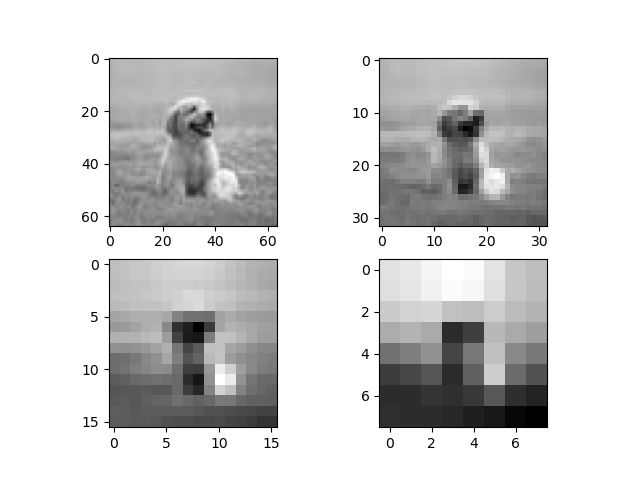
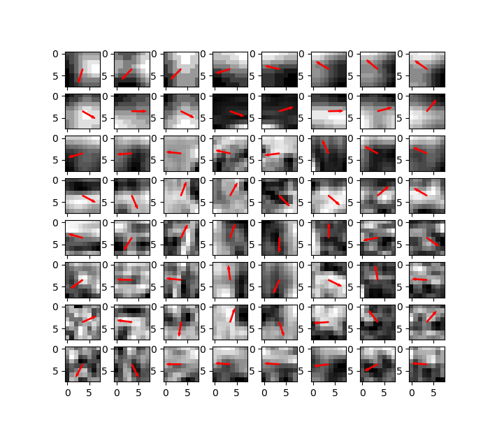

# ImageArrow
Task: Research and discuss how you could use a k-nearest neighbor classifier for image classification. 

## Intro
Little i don't know why i'm doing this but it sounds like fun project. To see whether some simple combinations of tricks can do well in image classification tasks with kNN classifier. It's really a funny toy weekend project.<br>

<br>
Basic idea:
1. Use gaussian filter to seperate the features in different scale levvel.
2. At each scale level apply a HoG method, and calculate the dominant direction via magnitude voting.
3. Append the voting result from all of the blocks to form a feature vector to represent this image.
4. Use kNN algorithm to classify the image.


## Datasets
The datasets tha I'm using for this tasks is [Linnaeus 5 dataset 64x64](http://chaladze.com/l5/). For simplicity (because i don't have much time) I've just apple the classes `dog` and `bird`. To prepare the requied dataset, put your downloaded dataset in dir `LinnaeusDS` and run the command:
```
cd /path/to/project/
cd LinnaeusDS
python database_verarbeitung.py
```
The script will do the preparations (convert to black white and reduce the number of samples) for you. And now you are ready to go!
## Rquirements & install
Install them with command:
```
pip install -r requirements.txt
```
Then you can play with the code in the jupyter notebook: )
## Result
